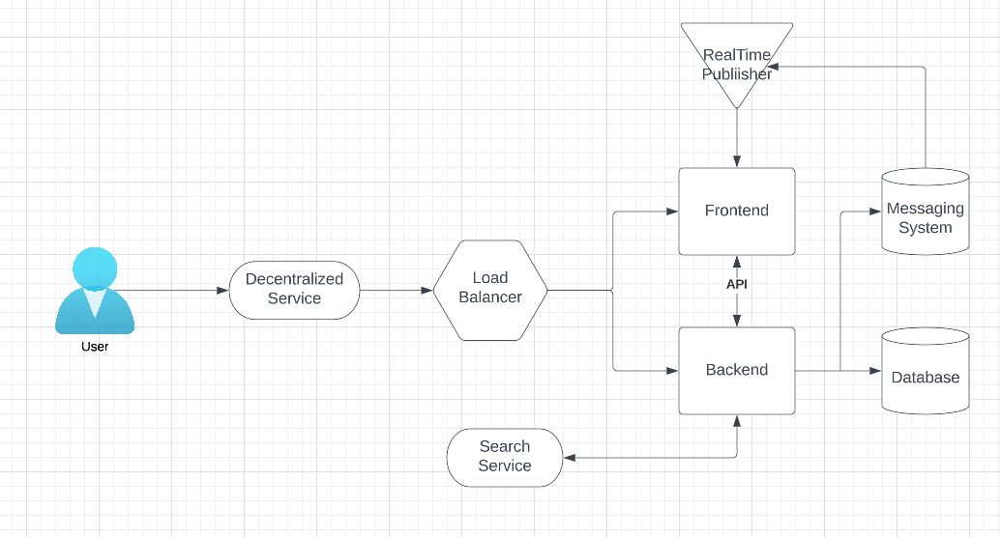
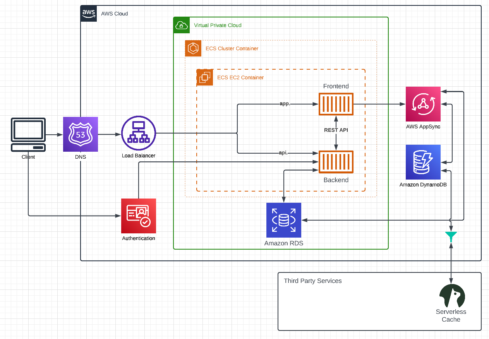

# Week 0 — Billing and Architecture

## Required Homework/Tasks

### Recreate Conceptual Diagram in Lucid Charts or on a Napkin


[Conceptual Diagram](https://lucid.app/lucidchart/6953b69d-d510-4867-9c9f-108bee8b67a0/edit?viewport_loc=-11%2C-11%2C2973%2C1596%2C0_0&invitationId=inv_dea2d3fd-298f-427c-ad88-4c1d940db631)

### Recreate Logical Architectual Diagram in Lucid Charts



[Logical Architectual Diagram](https://lucid.app/lucidchart/ad5b5581-b293-48fe-b45c-703154dd7bda/edit?viewport_loc=-376%2C-175%2C2973%2C1596%2C0_0&invitationId=inv_e152f2db-5330-4832-800f-48aa508dad01)

### Create an Admin User

I have create an user in my AWS account which is part of an group which has a policy "AdministratorAccess".

### Use CloudShell

I have used CloudShell and run:

```
$ aws sts get-caller-identity 
```

###	Generate AWS Credentials

I have generated AWS credentials ... trust me.

###	Installed AWS CLI

I have installed the AWS CLI on gitpod as per the Youtube video and updating the [.gitpod.yml](../.gitpod.yml) file

###	Create a Billing Alarm

TODO

###	Create a Budget

TODO
