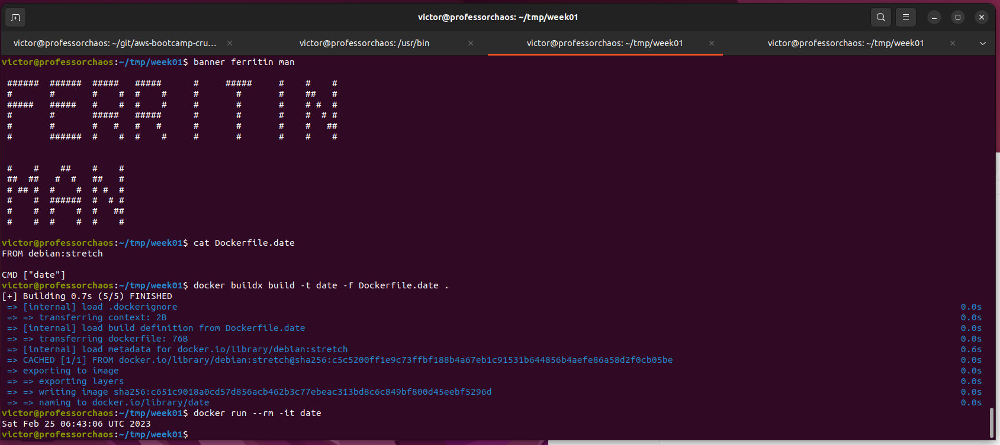
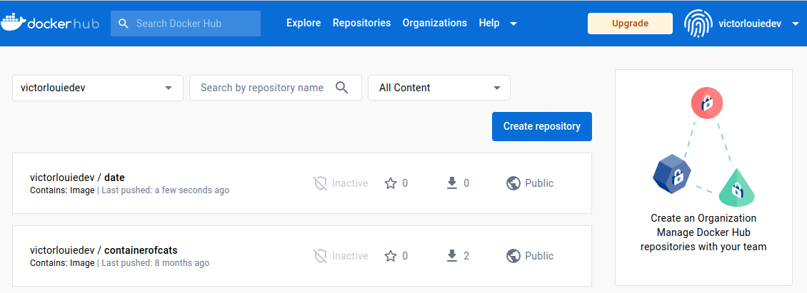
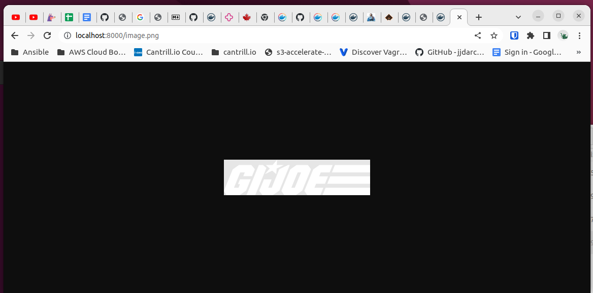
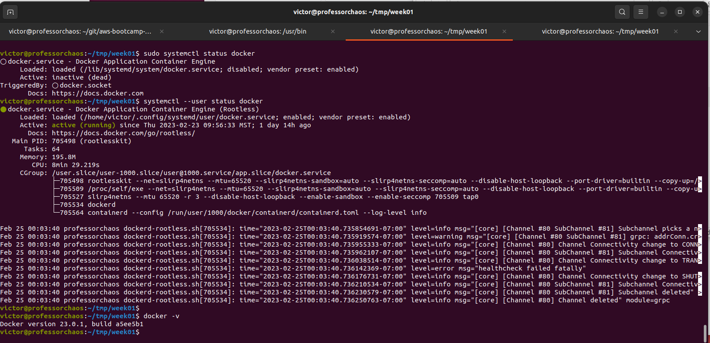

# Week 1 — App Containerization

## Required Homework/Tasks

### Containerize Application (Dockerfiles, Docker Compose)

- Created a [Dockerfile](../backend-flask/Dockerfile) in ./backend-flask and a [Dockerfile](../frontend-react-js/Dockerfile) ./frontend-reactjs to create docker images.

- Created a [docker-compose.yml](../docker-compose.yml) file in the main directory to be able to define and run multi-container applications (Flask, ReactJS, Postgres and DynamoDB)

### Document the Notification Endpoint for the OpenAI Document

- Briefly went over the [OpenAPI Specifications](https://spec.openapis.org/oas/latest.html) documentation  

- Updated [openapi-3.0.yml](../backend-flask/openapi-3.0.yml) to add a new notifications endpoint

### Write a Flask Backend Endpoint for Notifications

- Created a notification endpoint by:
    - Creating [notification_activities](../backend-flask/services/notifications_activities.py) 
    - Updating [app.py](../backend-flask/app.py)

### Write a React Page for Notifications

- Fixed up the notificaton page by:
    - Creating [NotificationsFeedPage.css](../frontend-react-js/src/pages/NotificationsFeedPage.css)
    - Creating [NotificationsFeedPage.js](../frontend-react-js/src/pages/NotificationsFeedPage.js)
    - Updating [App.js](../frontend-react-js/src/App.js)

### Run DynamoDB Local Container and ensure it works

- Made appropriate changes to the [docker-compose.yml](../docker-compose.yml) using a prebuilt image ([amazon/dynamodb-local](https://hub.docker.com/r/amazon/dynamodb-local))
- Ran "docker compose up" and tested it with examples from [100 Days of Cloud](https://github.com/100DaysOfCloud/challenge-dynamodb-local)

### Run Postgres Container and ensure it works

- Made appropriate changes to the [docker-compose.yml](../docker-compose.yml) using a prebuilt image ([postgres](https://hub.docker.com/_/postgres))
- Ran "docker compose up" and tested it connecting via psql

```bash
$ psql -U postgres -h localhost postgres
```


## Homework Challenges

### Run the dockerfile CMD as an external script

- Created a simple file called Dockerfile.date (it's not the default name but it's easier for me to distinguish for homework challenges)

- Unfortunately, I was unable to make "banner" print my username on one line without cutting off, so I used a space. It's just a limitation I will have to live with.

- I'm not exactly sure how I installed a version of docker build with build kit (hence, the buildx), so I read up on it a bit. [BuildKit](https://docs.docker.com/build/buildkit/)



### Push and tag a image to DockerHub (they have a free tier)

- I already had a previous DockerHub account from long ago.  This was pretty straight forward

```bash
$ docker login --username victorlouiedev

$ docker image ls
REPOSITORY   TAG       IMAGE ID       CREATED        SIZE
date         latest    c651c9018a0c   8 months ago   101MB

$ docker tag c651c9018a0c victorlouiedev/date:1.0.0

$ docker image ls
REPOSITORY            TAG       IMAGE ID       CREATED        SIZE
date                  latest    c651c9018a0c   8 months ago   101MB
victorlouiedev/date   1.0.0     c651c9018a0c   8 months ago   101MB

$ docker push victorlouiedev/date:1.0.0
```



### Use multi-stage building for a Dockerfile build

- I created a Dockerfile called Dockerfile.multi which is downloads a G.I. Joe logo from the Hasbro website and serves it on a webserver

- There are two issues I found with the file I created below

    1. CMD does not seem to work (I haven't figure this out yet).  Used RUN instead.
    2. EXPOSE 8000 is incorrect because default nginx configuration listens on port 80 

```dockerfile
FROM alpine AS downloader
WORKDIR /downloads
RUN apk --no-cache add curl
CMD ["curl", "-o", "image.png",  "https://gijoe.hasbro.com/images/nav-gijoe-logo.png" ]

FROM nginx:stable-alpine
COPY --from=downloader /downloads/image.png /usr/share/nginx/html/image.png
EXPOSE 8000
CMD ["nginx", "-g", "daemon off;"]
```

- This is functioning version
```dockerfile
FROM alpine AS downloader
WORKDIR /downloads
RUN apk --no-cache add curl
RUN curl -o image.png https://gijoe.hasbro.com/images/nav-gijoe-logo.png

FROM nginx:stable-alpine
COPY --from=downloader /downloads/image.png /usr/share/nginx/html/image.png
EXPOSE 80
CMD ["nginx", "-g", "daemon off;"]
```

- Building and running it
```bash
$ docker buildx build -t multi -f Dockerfile.multi . && \
     docker run -p 8000:80 --rm -it multi
```



### Implement a healthcheck in the V3 Docker compose file

- I did this one at work for Postgres, steps were similiar to [https://laurent-bel.medium.com/waiting-for-postgresql-to-start-in-docker-compose-c72271b3c74a]()

- Did have time to complete a working example this week

### Research best practices of Dockerfiles and attempt to implement it in your Dockerfile

- I followed the instructions from [Run the Docker daemon as a non-root user](https://docs.docker.com/engine/security/rootless/) for Ubuntu.

- I made a mistake by not installing uidmap but the install script caught it
```bash
victor@professorchaos:/usr/bin$ ./dockerd-rootless-setuptool.sh install
[ERROR] Missing system requirements. Run the following commands to
[ERROR] install the requirements and run this tool again.

########## BEGIN ##########
sudo sh -eux <<EOF
# Install newuidmap & newgidmap binaries
apt-get install -y uidmap
EOF
########## END ##########
```

### Learn how to install Docker on your localmachine and get the same containers running outside of Gitpod / Codespaces

- Docker was installed last week on my Ubuntu box.  I ran the steps for running it as a Docker daemon as a non-root user above.  If you look at the systemctl calls, you can see the original one is not running.



### Launch an EC2 instance that has docker installed, and pull a container to demonstrate you can run your own docker processes. 

- For the sake of time, I will skip it this week but it looks pretty straight forward