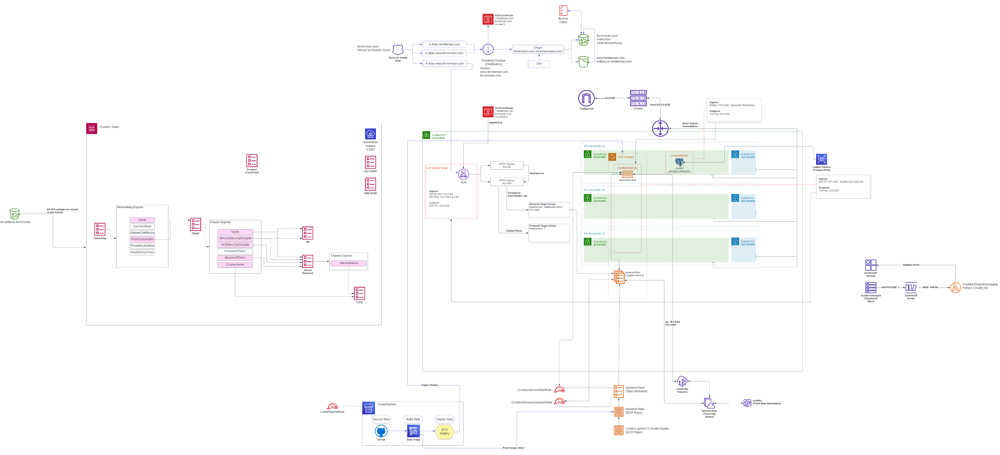
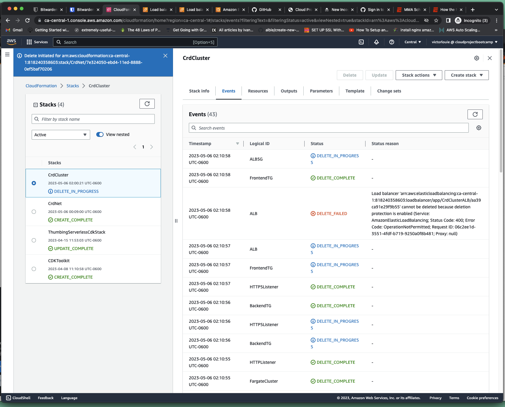
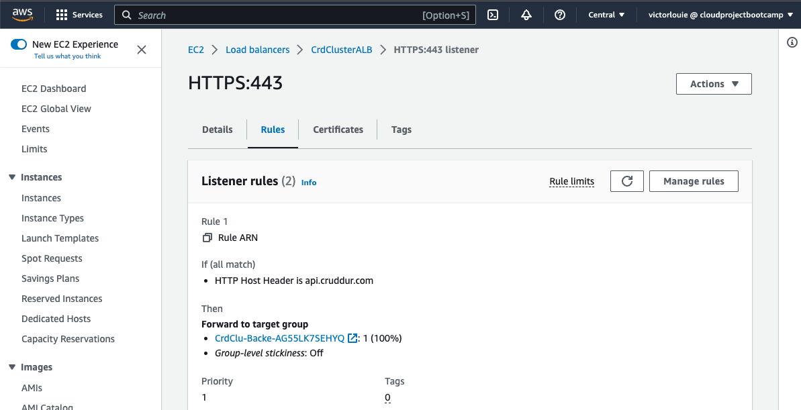
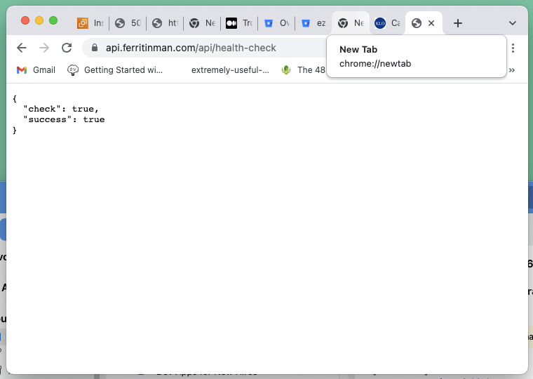

# Week 10 — CloudFormation Part 1

## Required Homework/Tasks

### CFN Files

I didn't type the files out and shamelessly cut and pasted most of the files from the "week-10-again" branch with modifications specific for my project.

### Diagraming

Along with creating the CFN files, I followed along and diagrammed the architecture using Lucid charts.

I am using my work account to do the diagrams so I didn't have any issues with the free tier shapes limit.



[Lucid Read Only](https://lucid.app/lucidchart/c5dbc9a0-5b03-4477-9817-c90c42701152/edit?view_items=uGOUi-jRc1q~&invitationId=inv_86d25ee3-a8dd-4769-8b09-21e0c760d0ad)

### Implement CFN Networking Layer

A CFN template was created that included the following resources:
- **AWS::EC2::VPC**
- **AWS::EC2::InternetGateway**
- **AWS::EC2::RouteTable**
- **AWS::EC2::Route**
- **AWS::EC2::Subnet**
- **AWS::EC2::SecurityGroup**
- **AWS::EC2::SubnetRouteTableAssociation**

### Implement CFN Cluster Layer

A CFN template was created that included the following main resources:
- **AWS::ECS::Cluster**: ECS Fargate cluster
- **AWS::ElasticLoadBalancingV2::LoadBalancer**: Loadbalancer for backend flask 
- **AWS::ElasticLoadBalancingV2::Listener**: Listener for the load balancer
- **AWS::ElasticLoadBalancingV2::ListenerRule**: ListenerRules for where to send request (api vs everything else)
- **AWS::ElasticLoadBalancingV2::TargetGroup**: Target group the listener sends to

When deleting the stack, I had to manually remove the deletion protection because CFN stack delete does not work without it and it takes forever to timeout.

```
      LoadBalancerAttributes:
      ...
        - Key: deletion_protection.enabled
          Value: true
```



I had another issue with the wrong listener rule because of too much copy pasta (api.cruddur.com)


### Implement CFN Toml

[https://github.com/teacherseat/cfn-toml](https://github.com/teacherseat/cfn-toml)

Added to the .gitpod.yml
```
  - name: cfn
    before: |
    ...
      gem install cfn-toml
```

### Implement CFN Service Layer for Backend

A CFN template was created that included the following main resources:
- **AWS::RDS::DBInstance**: Postgres RDS instance
- **AWS::EC2::SecurityGroup**: SG for RDS instance
- **AWS::RDS::DBSubnetGroup**: Subnet group for the RDS instance



### Implement CFN Database Layer (RDS)

A CFN template was created that included the following main resources:
- **AWS::RDS::DBInstance**: Postgres RDS instance
- **AWS::EC2::SecurityGroup**: SG for RDS instance
- **AWS::RDS::DBSubnetGroup**: Subnet group for the RDS instance

### Implement DynamoDB using SAM

Used AWS Serverless Application Model (SAM) to deploy a Lambda function.

We used SAM CLI to build, package and deploy out the a Lambda function for DDB.

### Implement CI/CD

A nested CFN template was used for CodeBuild to bake container images.

A CFN template was created that included the following main resources:
- **AWS::CloudFormation::Stack**: setup CFN stack for baking container images
- **AWS::CodeStarConnections::Connection**: connection required to setup GitHub that needs to be manually configured after the CFN 
- **AWS::CodePipeline::Pipeline**: sets up the pipeline to run "source", "build", and "deploy" backend flask application

### Implement CFN Static Website Hosting for Frontend

A CFN template was created that included the following main resources:
- **AWS::Route53::RecordSet**: for the root and www A records which forwards to a CloudFront distribution
- **AWS::CloudFront::Distribution**:  forward requests to S3 buckets and use an ACM certificate (from us-east-1)
- **AWS::S3::Bucket**: for root and www website hosting
