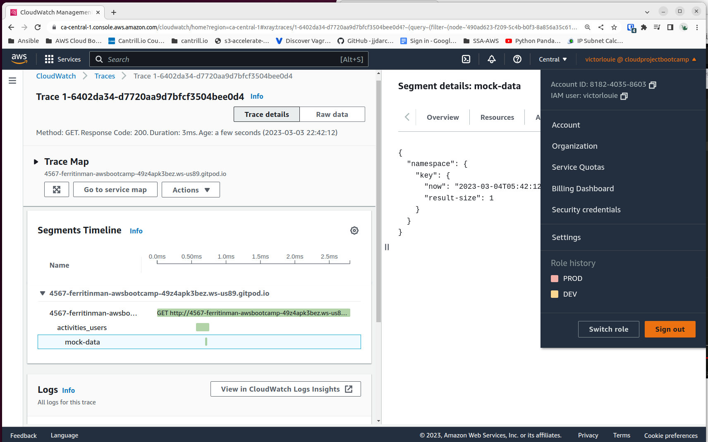

# Week 2 — Distributed Tracing

## Required Homework/Tasks

### Instrument Honeycomb with OTEL

Followed the instructions live.  I got hung up on this error

```
Failed to export batch code: 401, reason: {"message":"missing 'x-honeycomb-team' header"}
```

I finally gave up and launched a new GitPod workspace becasue the code appeared to be fine.  This resolved my issue.

### Instrument AWS X-Ray

Followed the video but was left in an incomplete state to be completed as a homework challenge.

### Configure custom logger to send to CloudWatch Logs

No issues with CloudWatch.  

### Integrate Rollbar and capture and error

No issues integrating Rollbar.  Stupid issue only for me is that my pi-hole hates the site so I had to disable it while working on it.

## Homework Challenges

### Tracing using AWS X-Ray with segments

From the X-Ray video, it was left in an incomplete state, so I wanted to see if I could get it working.

I grinded on this for a couple hours going through StackOverflow and other documentation.  I thought maybe it was because the segment was not closed.

```python
 xray_recorder.end_segment()
```

Noticed that all page requests should have a corresponding trace in CloudWatch X-Ray traces, but with the added code there is no trace.   I removed the code and it logged a trace fine.

Eventually, I found an [article](https://olley.hashnode.dev/aws-free-cloud-bootcamp-instrumenting-aws-x-ray-subsegments) from a fellow bootcamper by googling "x-ray segment flask".

I watched video you made.  I've cleaned up the code a bit because the try/finally block doesn't need to be there.  The issue was the annotation `@xray_recorder.capture` and removing the `begin_segment` and `end_segment`.



Also as part of the solutions video, I finally signed up a ChatGPT account.

I might do the other challenges at a later time.