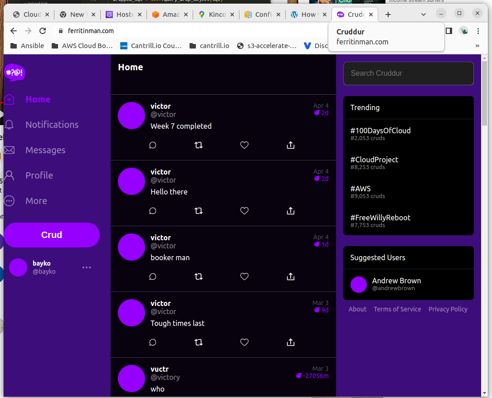
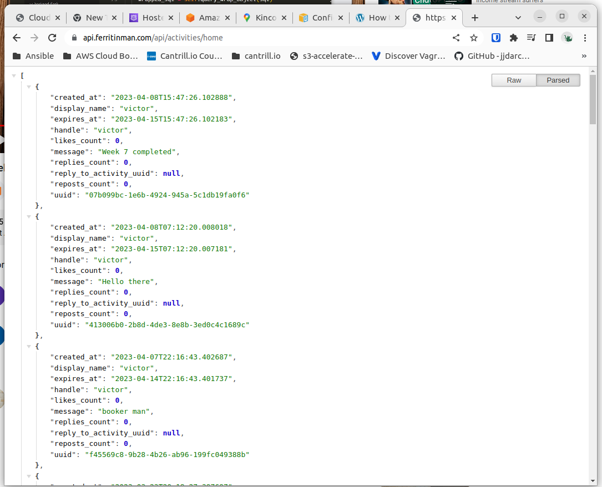
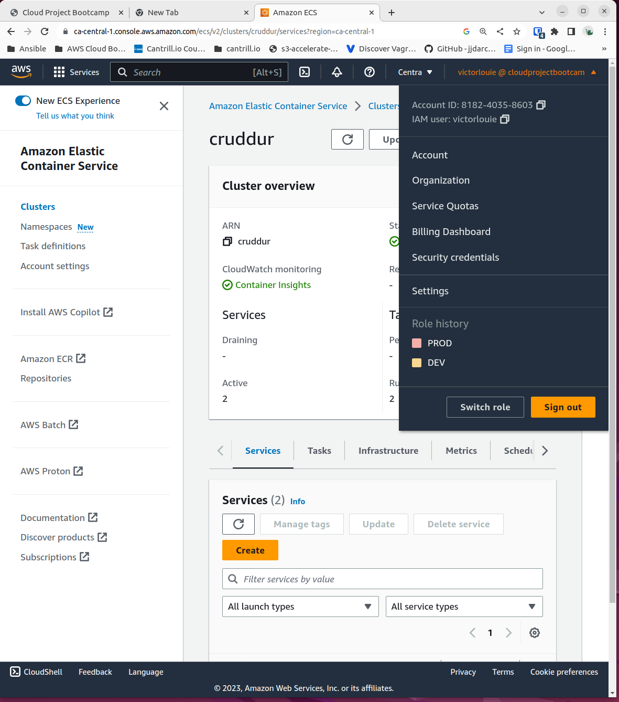
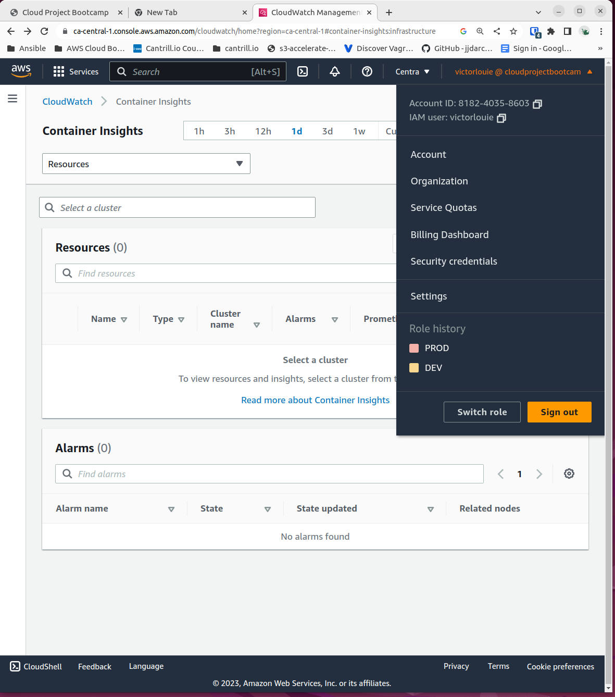

# Week 6 — Deploying Containers

## Required Homework/Tasks

### ECS Fargate

#### ECS/ECR

I was able to provision an ECS Cluster with two services (frontend-react-js and backend-flask) using manual click-ops and through the CLI (eventually using scripts)

Along the way, I created a private ECR registry to host my Docker images so I don't have to rely on Dockerhub being available.

Task definitions will have secrets stored in them from the parameter store (AWS Systems Manager).

#### Route53/ALB

I was able to manually create and configure an Application Load Balancer and associated target groups for "backend-flask" and "frontend-react-js". It listens on ports 80 and 443.  Port 80 redirects to 443 using a certificate from ACM.

The targets groups are specified in [service-backend-flask.json](../aws/json/service-backend-flask.json) and [service-frontend-react-js.json](../aws/json/service-frontend-react-js.json) when creating the service for the ECS cluster.

In Route 53, I create two A records (api and nake domain) with aliases pointing to the ALB I created earlier.  Aliases can only be with Route53. I learned there is way to allow Route 53 to manage the DNS from a domain registered elsewhere by configuring the nameservers to point to Route 53 nameservers.

### Securing Flask
I configured the production and dev Dockerfile to use different "CMD" commands to allow/disallow debugging and reloading.

I noticed on the Discord that there is a missing "Securing Flask (Part 2)" on the playlist, so I will have to go through that this week.  I didn't realize that until after the week ended and the subsequent videos has me copying scripts from the "week-6-again" branch because my file structure was not the same.

### Implement Refresh Token Cognito

I followed the video and was able to implement the refresh token.  I have to admit that my JS is not very strong.

#### Fix Messaging In Production

I fixed the short messaging on the Cruddur application and fixed up some of the utility scripts.

### Fargate - Configuring for Container Insights

I was able to follow along on the videos.  The Fargate containers were failing a health check because the directory path was incorrect due to some refactoring earlier.

Container Insights has been running on my ECS Fargate containers for a few days now, but I haven't received any logging yet.  I'll have to look into this when I have some time.

I learned how to use the "busybox" image to test connectivity and configured the Docker Compose file to explicity user a user-defined network.

I used Ruby to generate files using ERB templates for the Docker compose environment variables which cleaned up the docker-compose file.

I learned that AWS scans public github for AWS credentials and will lock down keys if they have been exposed publically.

The messaging is not working.  I believe I am in the same state as you are at the end of the video.

## Homework Challenges

I did not make time to this week to complete anything extra.
