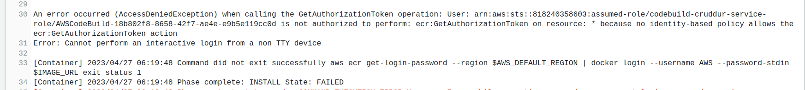
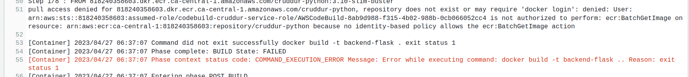
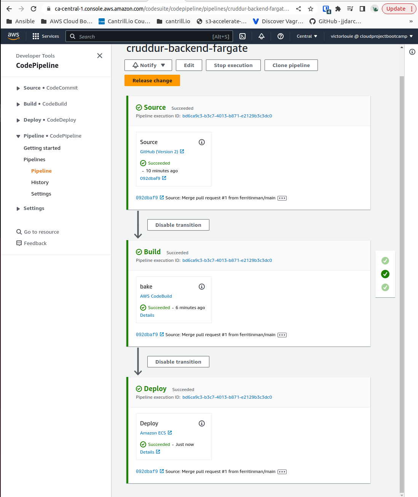
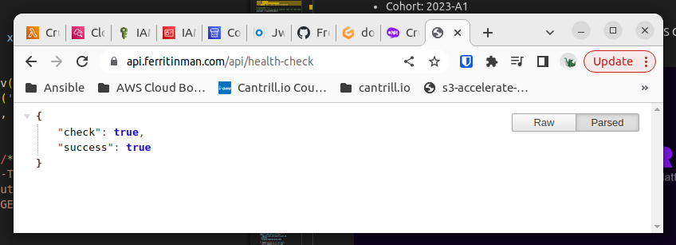

# Week 9 — CI/CD with CodePipeline, CodeBuild and CodeDeploy

## Required Homework/Tasks

### CodeBuild

I created a buildspec.yml to create a set of instructions to build my docker image for the backend-flask application.

#### Issues

I had some issues with additional permissions that were not included the video, so I made an inline policy to include the ECR permissions required.  The logs were from CloudWatch.






### CodePipeline

I created and configured a CodePipeline to checkout from the "prod" branch from my Github and build the docker image whenever a "PUSH" was detected.  I deviated from the video since it would be easier than pull requests for testing.

After the docker build is completed and uploaded to ECR (via CodeBuild), the pipeline deploys the new image into ECR Fargate.

#### Issues

I had an issue on CodePipeline failing to deploy to ECS Fargate. I checked the task logs and it was failing with an errors that looked like

```
AttributeError: 'Flask' object has no attribute 'before_first_request'. Did you mean: '_got_first_request'?
```

I went through all my check-in since week08 tag to see if I accidently fat fingered something. I wasn't able to find anything.

I slept on it and got back to it today. I restarted GitPod and got the same error.  I Googled the error and found that "before_first_request" was deprecated and removed in the Flask 2.3.0 which was released on April 25.

[https://flask.palletsprojects.com/en/2.3.x/changes/#version-2-3-0](https://flask.palletsprojects.com/en/2.3.x/changes/#version-2-3-0)

I'm a bit cooked from my Spring Boot upgrades at work, so I didn't want to go through the upgrade steps for Flask.

Crappy solution is to freeze the requirements.txt of Flask to 2.2.4.

Got everything deployed fine after that.



