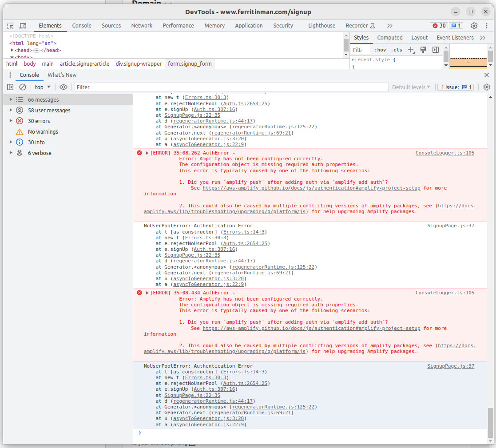
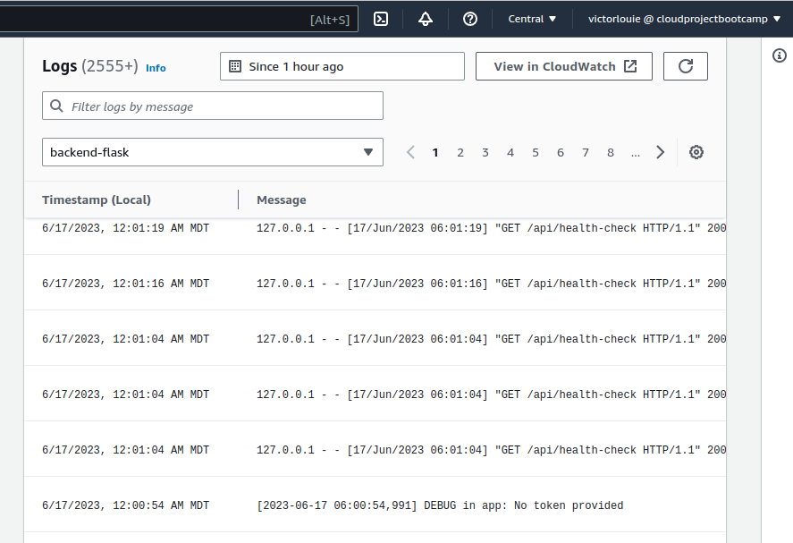

# Week X — Cleanup

## Required Homework/Tasks

### Sync tool for static website hosting

Create a script to build the static js site
```
 ./bin/frontend/static-build
```

Generate the new erb files (new one for 'sync')
```
./bin/frontend/generate-env
```

Tried to get GitHub actions working but that was left as WIP and maybe for extra homework.  Not sure I'll have to time to do it though.

[https://github.com/teacherseat/aws-s3-website-sync]()

### Reconnect DB and Postgre Confirmation Lamba

Corrected the backend-flask docker image to not display stacktrace for production site.

Fixed up TaskRoleArn on the Task Definition for backend-flask to be consistent with the name in the CFN template.

Modify "cruddur-post-confirmation" Lambda
* Change database connection
* Update VPC/Subnets
* Create new security groups
* Code modifications for database query issues

#### Troubleshooting


I tried doing some stuff like upgrading the libs and seeing if there was versioning issues.

[https://docs.amplify.aws/lib/troubleshooting/upgrading/q/platform/js/]()

```sh
gitpod /workspace/aws-bootcamp-cruddur-2023/frontend-react-js (main) $ npm ls -all 2>/dev/null | \
  grep -o -e '@\?aws-amplify[^ ]*' | \
  sort | uniq | \
  sed -E 's/^(@?[^@]+).*$/\1/g' | \
  uniq -d | sort
@aws-amplify/core
```

```sh
gitpod /workspace/aws-bootcamp-cruddur-2023/frontend-react-js (main) $ npx npm-check-updates -i '/@?aws-amplify/' && npm update
Need to install the following packages:
  npm-check-updates@16.10.12
Ok to proceed? (y) y
Upgrading /workspace/aws-bootcamp-cruddur-2023/frontend-react-js/package.json
[====================] 1/1 100%

✔ Choose which packages to update › 

 aws-amplify  ^5.0.16  →  ^5.2.7

✔ Run npm install to install new versions? … yes
...
...
...
```

Still no good.

Obviously something was incorrect with Cognito so I checked to see if the frontend build had the Cognito Client ID references and it came back with no result.  This was strange to me because how would the application know the value?

```sh
grep -r 17vmh2l62n9k69guut80jtnqsi .
```

I spun my wheels checking various files. Ended on [static-build](https://github.com/ferritinman/aws-bootcamp-cruddur-2023/commit/c14b4f0a131be06319e646e1b03cb90dd88c317f) script where I did not type the "\" after the variable assignment.

### Fix CORS to use domain name for web-app

I updated "EnvFrontendUrl" and "EnvBackendUrl" parameters in the CFN template files so the backend-flask application has CORS configured properly.

[https://github.com/ferritinman/aws-bootcamp-cruddur-2023/commit/b74b24555099ca11cc228d8130312834e450ce22](https://github.com/ferritinman/aws-bootcamp-cruddur-2023/commit/b74b24555099ca11cc228d8130312834e450ce22)

### Ensure CI/CD pipeline works and create activity works

I followed along with the video and fixed up the following:
* Hard coding username "bayko" the /api/activites endpoint on the backend-flask application and using the authorization token instead
* Corrected the CFN files for CI/CD since they were missing permissions and had incorrect configuration values

#### Troubleshooting



When trying to create a new crud at the end of the video, I was getting "No token provided" in CloudWatch.

I did a few comparison of files to see if I messed up something in the files.  Unfortunately, the files aren't the same in the week-x branch on omenking.  I did some blind copy and paste without actually looking at the code.  After some time I realized that I did not sync the js files which is why the token is missing from the headers.


### Refactor to use JWT Decorator in Flask App


###	Refactor App.py


### Refactor Flask Routes

### Implement Replies for Posts

### Improved Error Handling for the app

### Activities Show Page

### More General Cleanup Part 1 and Part 2